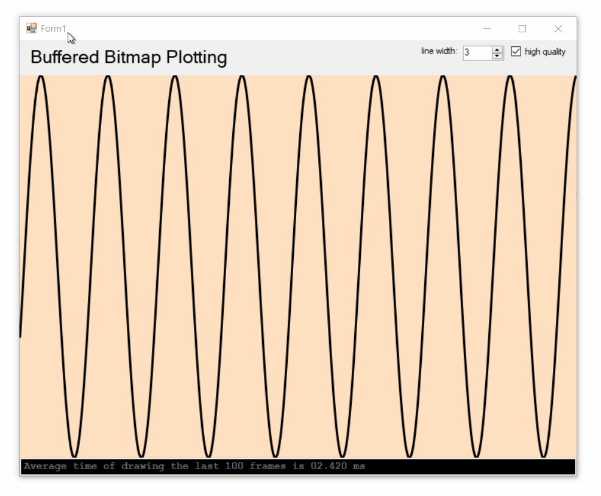

# Csharp-Data-Visualization
This repository is a collection of minimal-case example projects to display data with Visual Studio. Code here is mostly written in C# using [Visual Studio Community 2017](https://www.visualstudio.com/downloads/) and only using free software and plugins.

* Each section below is an entirely standalone Visual Studio [solution](https://msdn.microsoft.com/en-us/library/b142f8e7.aspx) with a single [project](https://msdn.microsoft.com/en-us/library/b142f8e7.aspx).
* Projects get progressively more advanced (and more well-written) from bottom to top.

Project Description | Screenshot
---|---
**[interactive electrophysiology data](/projects/17-06-26_abf_data)** Nearly identical to the previous example, except that there is a CSV button which loads an arbitrary string of values from `data.csv` if it is saved in the same folder as the exe. With minimal effort this program could be modified to directly load from ATF (Axon Text Format) files. With a little more effort, you could interface ABF files with the [Axon pCLAMP ABF SDK](http://mdc.custhelp.com/app/answers/detail/a_id/18881/~/axon%E2%84%A2-pclamp%C2%AE-abf-file-support-pack-download-page). | 
**[interactive pan and zoom](/projects/17-06-25_pan_and_zoom)** The [`ScottPlot` class](/projects/17-06-25_pan_and_zoom/swharden_demo/ScottPlot.cs) now has an advanced axis system. This makes it easily to set the viewing window in unit coordinates (X1, X2, Y1, Y2) and also do things like zoom and pan. This example was made to demonstrate these functions, as well as compare the speed of interactive graph manipulation at different sizes and with different quality settings. Although the GUI has many features, [Form1.cs](projects/17-06-25_pan_and_zoom/swharden_demo/Form1.cs) is not overwhelmingly complex. | 
**[stretchy line plot](/projects/17-06-24_stretchy_line_plot/)** In this demo some random points are generated and scrolled (similar to numpy's [roll](https://docs.scipy.org/doc/numpy-1.10.0/reference/generated/numpy.roll.html) method). Although the result looks simple, there is some strong thought behind how this example is coded. All the graphing code is encapsulated by the `ScottPlot` class of [swhPlot.cs](projects/17-06-24_stretchy_line_plot/pixelDrawDrag2/swhPlot.cs). The code of the GUI itself [Form1.cs](projects/17-06-24_stretchy_line_plot/pixelDrawDrag2/Form1.cs) is virtually empty. My thinking is that from here I'll work on the graphing class, keeping gui usage as simple as possible. _Note: plotting 321 data points I'm getting about 300Hz drawing rate with anti-aliasing off and 100Hz with it on_ | 
**[basic buffered line plot](/projects/17-06-24_buffered_line_plot)** graphs data by creating a bitmap buffer, drawing on it with `System.Drawing.Graphics` (mostly `DrawLines()`) with customizable pens and quality (anti-aliasing), then displaying it onto a frame. The frame is resizable, which also resizes the bitmap buffer. Screen updates are timed and reported (at the bottom) so performance at different sizes can be assessed. | 

# ScottPlot
This series of projects is ramping up to a feature-rich portable class library encapsulating the ScottPlot class, designed to plot massive datasets at high framerates. The ScottPlot class is designed to make this as simple as possible. Basically you tell it the dimensions of the image, give it X and Y data, define the axis limits, then it plots the result to a bitmap you can apply as the background of a picturebox (and/or saved as a file).

#### Example Usage
```C#
ScottPlot SP = new ScottPlot(); // initialize the ScottPlot class
SP.Xs = new List<double> {1, 2, 3, 4, 5}; // give it some X values (optional)
SP.Ys = new List<double> {5.6, 1.2, 3.3, 1.9, 7.5}; // give it some Y values
SP.AxisFit(); // automatically set the axis limits to fit the data
SP.setSize(800, 600); // tell it we want a picture 800px by 600px
SP.PlotXY(); // plots the data using in a bitmap buffer
pictureBox1.BackgroundImage = SP.bufferGraph; // apply the bitmap to a picturebox
```

## Additional Details

### Project Goals
* ability to plot _massive_ datasets (1,000,000 X/Y pairs) rapidly
* emphasis on time-domain plotting (signal analysis)
* high framerate suitable for realtime plotting of live data
* Ultimate goal is to have a ScottPlot library with a custom control.

### Similar Projects
* [Microsoft Chart Controls](https://code.msdn.microsoft.com/mschart)
  * Natively supported by Visual Studio
  * not a good solution for massive datasets
  * not a good solution for interactive charts
* [OxyPlot](http://www.oxyplot.org/)
  * Distributed as a portable class library which I like
  * a little heavier than I intend to use
  * not designed with performance for massive datasets in mind
  * interactive manipulation requires dragging axes, not the graph
* [LiveCharts](https://github.com/beto-rodriguez/Live-Charts)
  * they put more emphasis on pretty and animated graphs
* [ZedGraph](http://zedgraph.sourceforge.net/samples.html)
  * no longer maintained?
  * not a good solution for massive datasets
  
### Development Environment
* These projects were developed with [Visual Studio Community 2017](https://www.visualstudio.com/downloads/)
