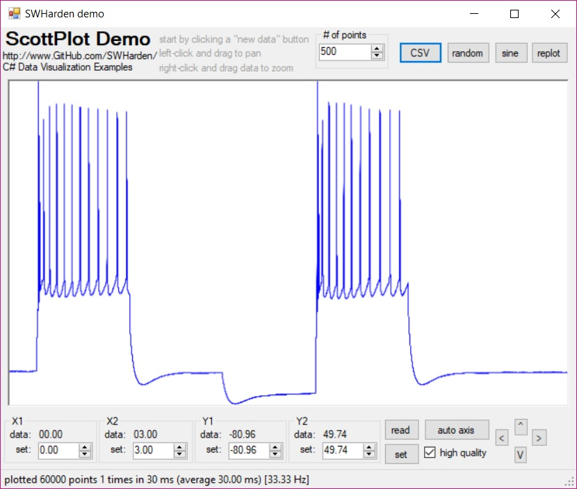

# Csharp-Data-Visualization
This repository is a collection of minimal-case example projects to display data with Visual Studio. Code here is mostly written in C# using [Visual Studio Community 2017](https://www.visualstudio.com/downloads/) and only uses free software and plugins.

* Each example below is a standalone Visual Studio solution
* Projects increase in complexity from bottom to top
* Work here led to the development of [ScottPlot](https://github.com/swharden/ScottPlot), an open-source interactive graphing library for .NET
* The [projects folder](projects) contains in-progress and unfinished works. Only completed projects are listed below.

Project Description | Screenshot
---|---
**[DataView 1.0](/projects/18-01-15_form_drawing/)** is an interactive plotting control written using only the standard library. It allows panning/zooming by left-click-dragging the axis labels, moving the scrollbars, clicking the buttons, and also through right-click menus on the axis labels. Interactive draggable markers are also included. This control was designed to look similar to the commercial software ClampFit. I have decided to re-code this project from the ground-up, but the solution is frozen as-is (in a quite useful state) and the project page contains many notes of considerations and insights I had while developing it. | 
**[QRSS Spectrograph](/projects/18-01-14_qrss/)** produces spectrographs which are very large (thousands of pixels) and very high frequency resolution (fractions of a Hz) intended to be used to decode slow-speed (1 letter per minute) frequency-shifting Morse code radio signals, a transmission mode known as QRSS. While functional as it is, this project is intended to be a jumping-off point for anybody interested in making a feature-rich QRSS viewer.|
**[realtime audio spectrograph](/projects/18-01-11_microphone_spectrograph/)** listens to your default recording device (microphone or StereoMix) and creates a 2d time vs. frequency plot where pixel values are relative to frequency power (in a linear or log scale). This project is demonstrated in a YouTube video. This example is not optimized for speed, but it is optimized for simplicity and should be very easy to learn from.|
**[realtime audio level meter](/projects/18-01-09_microphone_level_meter/)** uses NAudio to provide highspeed access to the microphone or recording device. This project is a minimal-case project intended to remind the author how to effeciently interact with incoming audio data.|
**[realtime graph of microphone audio (RAW and FFT)](/projects/17-07-16_microphone/)** Here I demonstrate a minimal-case example using the interactive graphing framework (below) to display audio values sampled from the microphone in real time. FFT () is also calculated and displayed interactively. [See this project demonstrated on YouTube](https://youtu.be/qUlCImYOC8c). Audio capture is achieved with nAudio and FFT with Accord. See [FFT notes](/notes/FFT.md) for additional details. | 
**[linear data speed rendering](/projects/17-07-03_wav_speed_rendering/)** I **dramatically** sped-up the graphing by drawing only single vertical lines (of small range min and max values) when the point density exceeds the horizontal pixel density. This is only suitable for evenly-spaced linear data (which is exactly what my target applications will be plotting). Performance is great, and there is plenty of room for improvement on the coding side too. `AddLineXY()` will be used to manually draw a line between every X,Y point in a list. `AddLineSignal()` graphs data from huge amounts of linear data by only graphing vertical lines.| 
**[intelligent axis labels](/projects/17-07-02_nice_axis)** This from-scratch re-code has separate classes for core plotting routines, data generation, and axis manipulation. Tick marks are quite intelligent as well. Included is a GUI demo (shown) as well as a 6 line console application which does the same thing (saving the output to a .jpg file instead of displaying it interactively).| 
**[interactive electrophysiology data](/projects/17-06-26_abf_data)** Nearly identical to the previous example, except that there is a CSV button which loads an arbitrary string of values from `data.csv` if it is saved in the same folder as the exe. With minimal effort this program could be modified to directly load from ATF (Axon Text Format) files. With a little more effort, you could interface ABF files with the [Axon pCLAMP ABF SDK](http://mdc.custhelp.com/app/answers/detail/a_id/18881/~/axon%E2%84%A2-pclamp%C2%AE-abf-file-support-pack-download-page). | 
**[interactive pan and zoom](/projects/17-06-25_pan_and_zoom)** The ScottPlot class now has an advanced axis system. This makes it easily to set the viewing window in unit coordinates (X1, X2, Y1, Y2) and also do things like zoom and pan. This example was made to demonstrate these functions, as well as compare the speed of interactive graph manipulation at different sizes and with different quality settings. Although the GUI has many features, [Form1.cs](projects/17-06-25_pan_and_zoom/swharden_demo/Form1.cs) is not overwhelmingly complex. | 
**[stretchy line plot](/projects/17-06-24_stretchy_line_plot/)** In this demo some random points are generated and scrolled (similar to numpy's [roll](https://docs.scipy.org/doc/numpy-1.10.0/reference/generated/numpy.roll.html) method). Although the result looks simple, there is some strong thought behind how this example is coded. All the graphing code is encapsulated by the ScottPlot class of [swhPlot.cs](projects/17-06-24_stretchy_line_plot/pixelDrawDrag2/swhPlot.cs). The code of the GUI itself [Form1.cs](projects/17-06-24_stretchy_line_plot/pixelDrawDrag2/Form1.cs) is virtually empty. My thinking is that from here I'll work on the graphing class, keeping gui usage as simple as possible. _Note: plotting 321 data points I'm getting about 300Hz drawing rate with anti-aliasing off and 100Hz with it on_ | 
**[basic buffered line plot](/projects/17-06-24_buffered_line_plot)** graphs data by creating a bitmap buffer, drawing on it with `System.Drawing.Graphics` (mostly `DrawLines()`) with customizable pens and quality (anti-aliasing), then displaying it onto a frame. The frame is resizable, which also resizes the bitmap buffer. Screen updates are timed and reported (at the bottom) so performance at different sizes can be assessed. | 
**[highspeed bitmap pixel access](/projects/18-01-10_fast_pixel_bitmap/)** requires some consideration. This minimal-case project demonstrates how to set individual pixels of a bitmap buffer using the slower (simpler) setpixel method and the faster (but more complex) lockbits method. Once a bitmap buffer is modified, it is then applied to a pictutremap. | 
