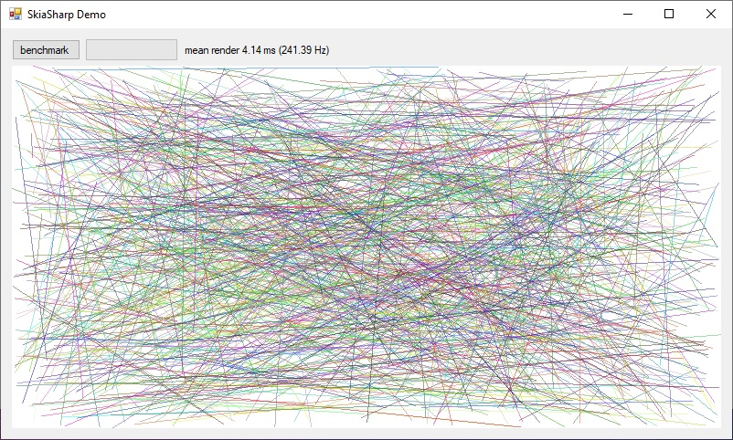

# SkiaSharp and OpenGL
This project demonstrates how to perform hardware-accelerated 2D drawing using SkiaSharp and the GLControl (not SKGLControl) in a Windows Forms Application. 




## Download Binary
* [SkiaSharp-OpenGL-Demo.zip](SkiaSharp-OpenGL-Demo.zip)

## Setup (for new projects)
This is the sequence of steps I used to create this project:

* Create a Windows Application (.NET Framework 4.6)
* NuGet to install [OpenTK.GLControl](https://www.nuget.org/packages/OpenTK.GLControl/)
* NuGet to install [SkiaSharp](https://www.nuget.org/packages/SkiaSharp/)
* Set your project to build for x64 (_not_ "any CPU")
* Add `using OpenTK.Graphics.ES20;` to top of file
* Add `using SkiaSharp;` to top of file
* Add `glControl1.Paint += new PaintEventHandler(RenderWithOpenGL);` to initializer
* Add `RenderWithOpenGL()` (below)

```cs

private void RenderWithOpenGL(object sender, PaintEventArgs e)
{
    // make our surface the same size as the user control
    Control sctl = (Control)sender;
    int width = sctl.Width;
    int height = sctl.Height;

    // setup the Skia surface using OpenGL
    SKColorType colorType = SKColorType.Rgba8888;
    GRContext contextOpenGL = GRContext.Create(GRBackend.OpenGL, GRGlInterface.CreateNativeGlInterface());
    GL.GetInteger(GetPName.FramebufferBinding, out var framebuffer);
    GRGlFramebufferInfo glInfo = new GRGlFramebufferInfo((uint)framebuffer, colorType.ToGlSizedFormat());
    GL.GetInteger(GetPName.StencilBits, out var stencil);
    GRBackendRenderTarget renderTarget = new GRBackendRenderTarget(width, height, contextOpenGL.GetMaxSurfaceSampleCount(colorType), stencil, glInfo);
    SKSurface surface = SKSurface.Create(contextOpenGL, renderTarget, GRSurfaceOrigin.BottomLeft, colorType);

    // clear the background
    surface.Canvas.Clear(SKColor.Parse("#FFFFFF"));

    // draw a line
    var paint = new SKPaint();
    paint.Color = new SKColor(0, 0, 0);
    surface.Canvas.DrawLine(0, 0, width, height, paint); 

    // Force a display
    surface.Canvas.Flush();
    glControl1.SwapBuffers();

    // prevent memory access violations by disposing before exiting
    renderTarget?.Dispose();
    contextOpenGL?.Dispose();
    surface?.Dispose();
}
```
