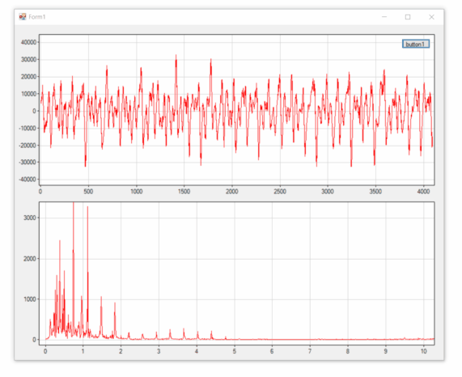

# Realtime Graphing of Microphone Audio with FFT Display using C# (Visual Studio 2017)



* **Project Demo on YouTube:** https://youtu.be/q9cRZuosrOs
* **Updated Video on YouTube:** https://youtu.be/qUlCImYOC8c

* See notes related to [calculating FFT with C#](/notes/FFT.md)
* **WHY THIS PROJECT EXISTS:** This is intended to be a minimal case example how to capture audio data from the microphone and display it in real time. It is not a polished project. It is essentially a note-to-self project uploaded to provide code reference for the author in the future. I'm sharing it online so others may benefit from reviewing its code.
* **ScottPlot** is a user control I am currently developing. It will be its own GitHub project when it is completed, but it's not ready yet. I'm adding a _zip snapshot_ of the current development project frozen in time. If you are going to try to run this project as-is, you'll need to add ScottPlot as a reference.


# Code Notes

#### Set the audio device number (important if multiple inputs exist)
```c#
WaveIn wi = new WaveIn();
wi.DeviceNumber = 0;
wi.WaveFormat = new NAudio.Wave.WaveFormat(44100, 1);
```

#### Integrate a byte array into a 16-bit values
```c#
int frameSize = 1024; // how much buffer to read at once
var frames = new byte[frameSize]; // init the byte array
bwp.Read(frames, 0, frameSize); // read the buffer
int SAMPLE_RESOLUTION = 16; // this is for 16-bit integers in a byte array
int BYTES_PER_POINT = SAMPLE_RESOLUTION / 8;
Int32[] vals = new Int32[frames.Length/BYTES_PER_POINT];
for (int i=0; i<vals.Length; i++)
{
    byte hByte = frames[i * 2 + 1];
    byte lByte = frames[i * 2 + 0];
    vals[i] = (int)(short)((hByte << 8) | lByte);
}
```

#### Load data into ScottPlot user control
```c#
scottPlotUC1.Xs = Xs;
scottPlotUC1.Ys = Ys;
scottPlotUC1.UpdateGraph();
```

#### Standalone FFT Function (give it a double array, it returns a double array)
```c#
public double[] FFT(double[] data)
{
    double[] fft = new double[data.Length]; // this is where we will store the output (fft)
    Complex[] fftComplex = new Complex[data.Length]; // the FFT function requires complex format
    for (int i = 0; i < data.Length; i++)
    {
        fftComplex[i] = new Complex(data[i], 0.0); // make it complex format (imaginary = 0)
    }
    Accord.Math.FourierTransform.FFT(fftComplex, Accord.Math.FourierTransform.Direction.Forward);
    for (int i = 0; i < data.Length; i++)
    {
        fft[i] = fftComplex[i].Magnitude; // back to double
        //fft[i] = Math.Log10(fft[i]); // convert to dB
    }
    return fft;
}
```

### Note on Framerate
I got a large framerate increase when I modified the buffer size. Here is [similar init code from another project](https://github.com/swharden/Csharp-Data-Visualization/tree/master/projects/18-01-09_microphone_level_meter) which demonstrates the idea with comments:

```c#
int RATE=44100; // sample rate of the microphone
int BUFFER_SAMPLES=1024; // powers of two help for FFT

var waveIn = new WaveInEvent();
waveIn.DeviceNumber = 0; // change this to select different sound inputs
waveIn.WaveFormat = new NAudio.Wave.WaveFormat(RATE, 1); // 1 for mono
waveIn.DataAvailable += OnDataAvailable; // this function must exist
waveIn.BufferMilliseconds = (int)((double)BUFFER_SAMPLES / (double)RATE * 1000.0);
waveIn.StartRecording();
```

### PACKAGES
I reduced the size of this GitHub project by not including the packages folder. It contians the following folders:

* Accord.3.6.0
* Accord.Audio.3.6.0
* Accord.Math.3.6.0
* NAudio.1.8.0

All of these can be downloaded on your own system with nuget.
