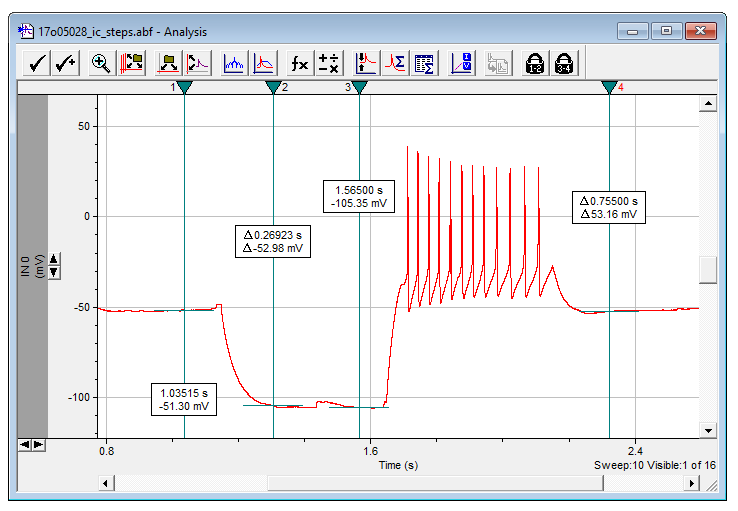
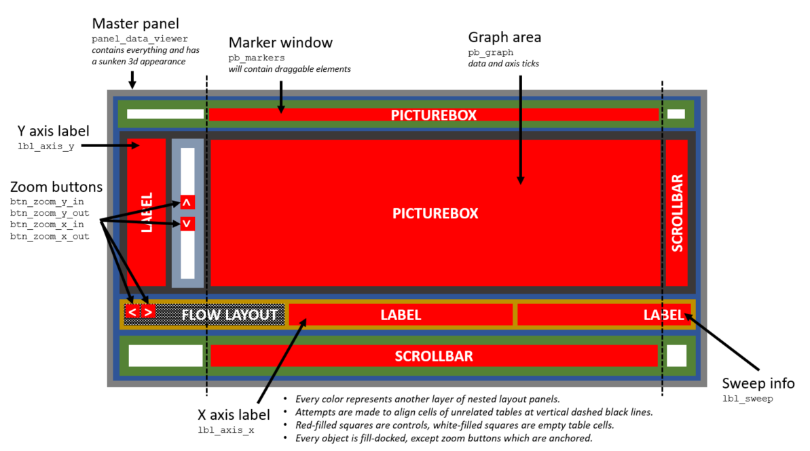
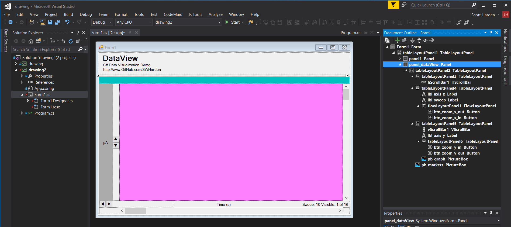

# DataView Control

The goal of this project is to create a user control to easily navigate evenly-spaced data. This is ideal for visualizing temperature over time, audio data, electrophysiological recordings, etc. I will attempt to re-create ClampFit's data interactive interface in facetious detail.

## Inspection of ClampFit Interface

This is what a data window looks like inside ClampFit. Although there is a toolbar on the top, all of the data is displayed in a sunken panel. 

The image inside the data area of this sunken panel is extremely similar to what [ScottPlot](https://github.com/swharden/ScottPlot) can do, so with a little tweaking we should be able to create a problem that mimics this one. 

This is how I intend to break-up my form. I'll keep as much as possible as windows form events (labels, scrollbars, etc) and minimize the size and complexity of the bitmap I'll be updating with the axis and data changes. I suspect I can do this with two primary table layout controls. This would almost work perfectly as a single table layout (grid), but the label on the bottom right spans two columns so if I intend to be exact to the ClampFit screenshot, I'll stick with nested layouts.

## Designing a Resizable Layout

### First Iteration: Pixel Placement
I built an iteration of layout controls which require pixel-calculated placement. In other words I just dropped buttons and scrolls randomly on the form, and every time the form was resized I had a function calcaulate where they should be and set their positions. This worked, but was hard to maintain when small adjustments were desired (i.e., changing the width of a scrollbar). Early versions of this are projects in the Visual Studio solution.

### Second Iteration: Nested Table Layouts
I started over and made a nicer layout which entirely uses nested tables. I found if I have several rows or columns in a table and fix the pixel sizes of each cell except one, it resizes nicely.

### Design

### Implementation

### My version is getting pretty close!

